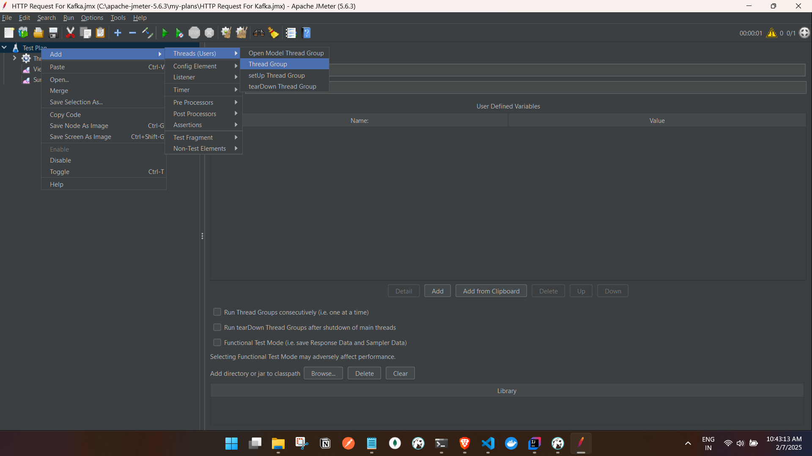
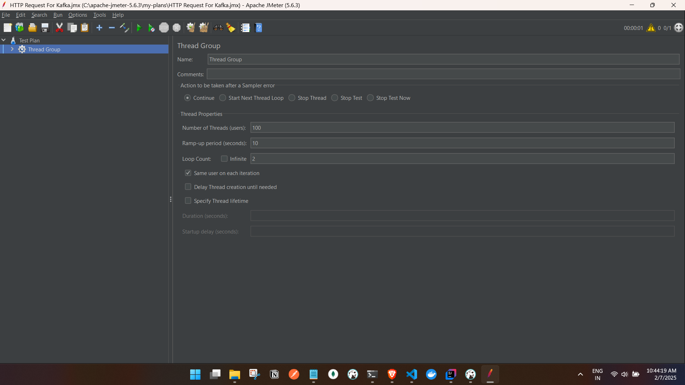
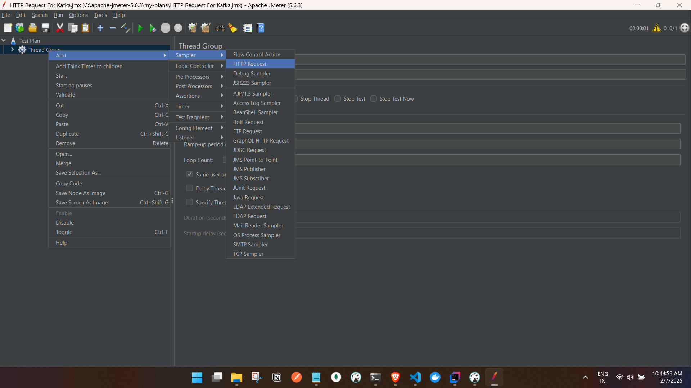
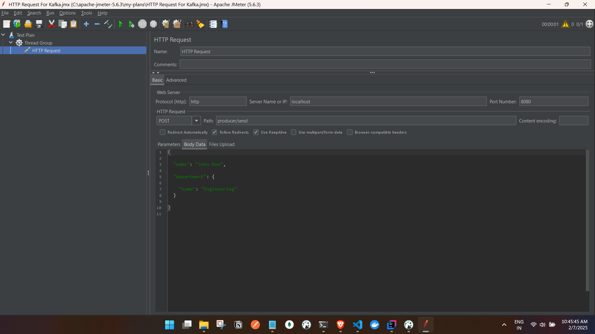
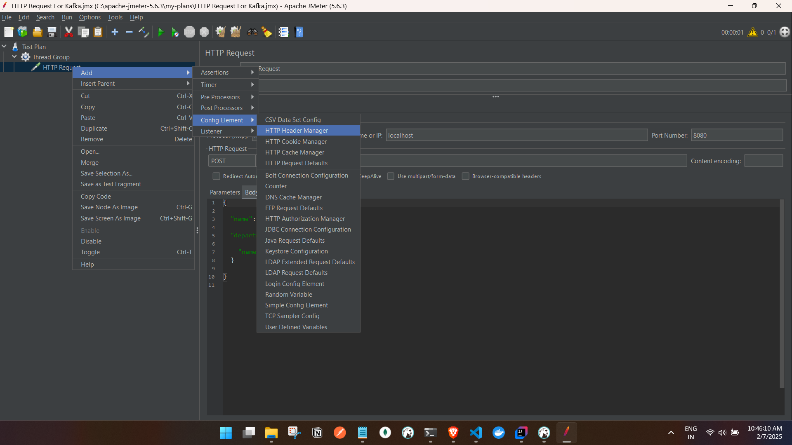
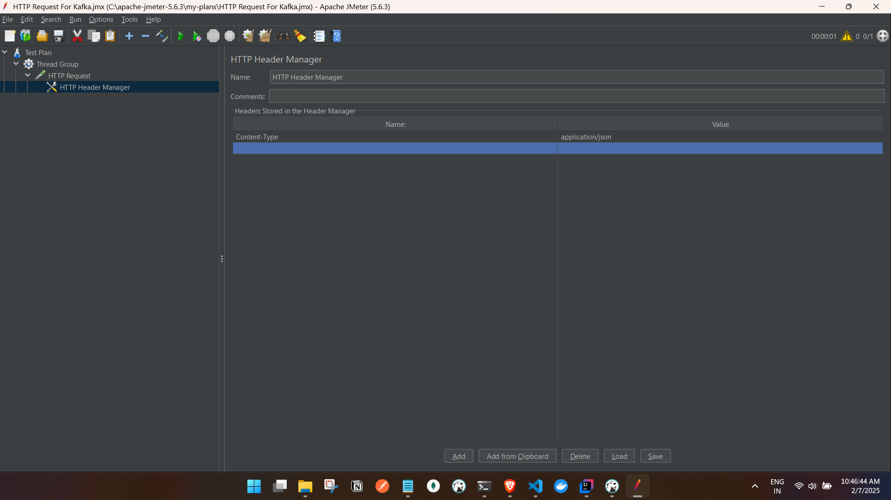
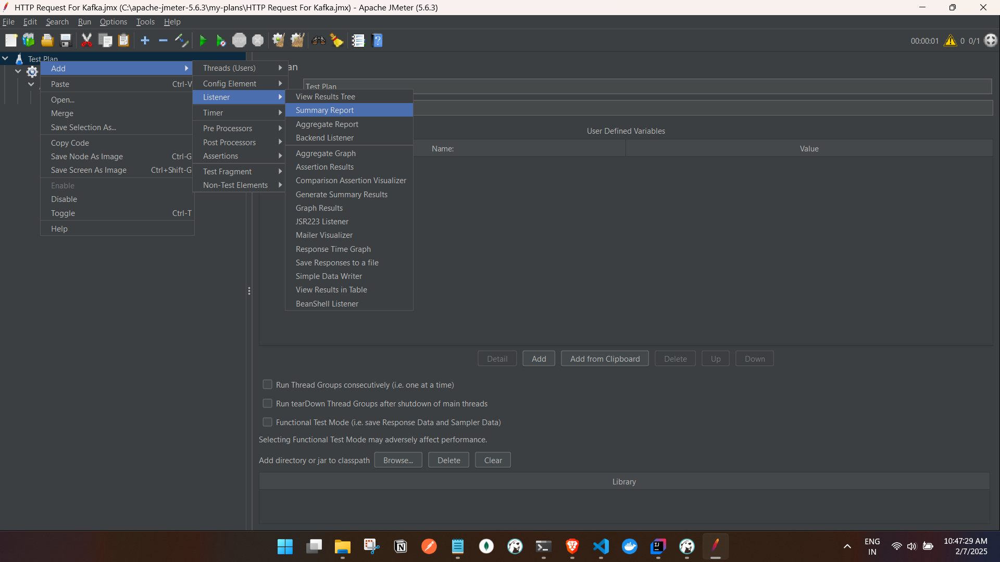
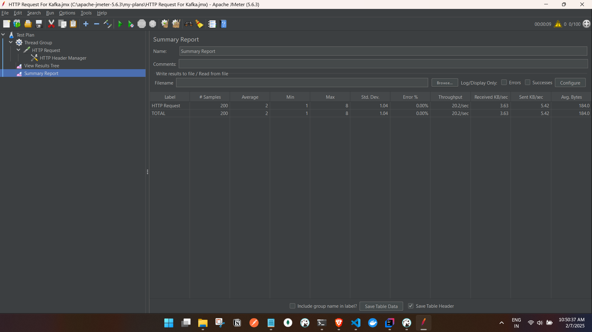
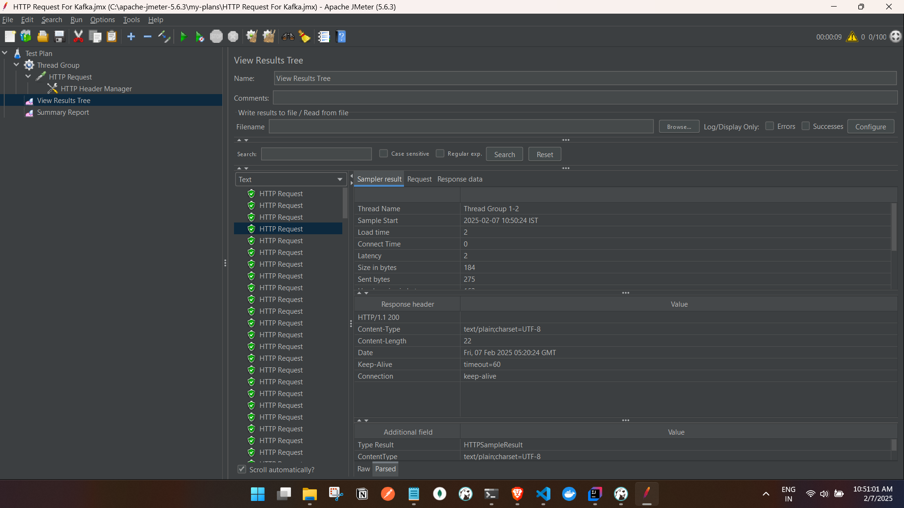

## Testing a Spring Boot API with requestBody with JMeter:


### API

```
    @PostMapping("/send")
    public ResponseEntity<String> sendEmployee(@RequestBody EmployeeDTO employeeDTO) {
        System.out.println("Producer : " + employeeDTO);

        kafkaTemplate.send("employee-topic", employeeDTO);
        return ResponseEntity.ok("Employee sent to Kafka");
    }

```

- RequestBody
```
{
  
  "name": "John Doe",
  
  "department": {

    "name": "Engineering"
  }
 
}

```

- Start the JMeter
- create a test plan and create a thread group



configure the threads, eg 100 threads for 2 loops.

- Create a http request and configure it.



- we have to add header "Content-Type:application/json" to the request as we are sending json.



- Add the summary report and view result tree in jmeter.


- Save the plan for reusability and run the plan.

