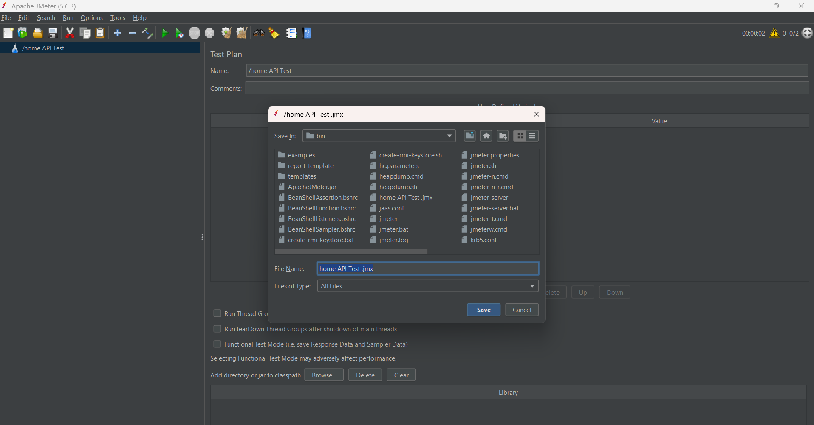
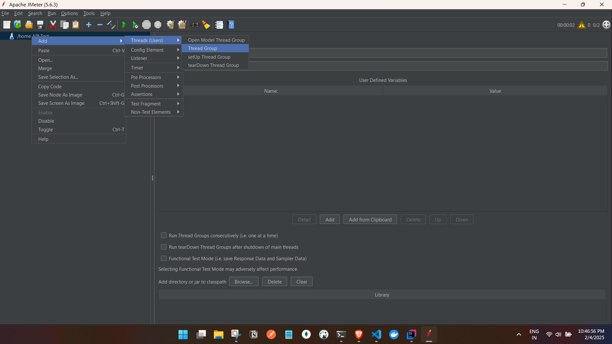
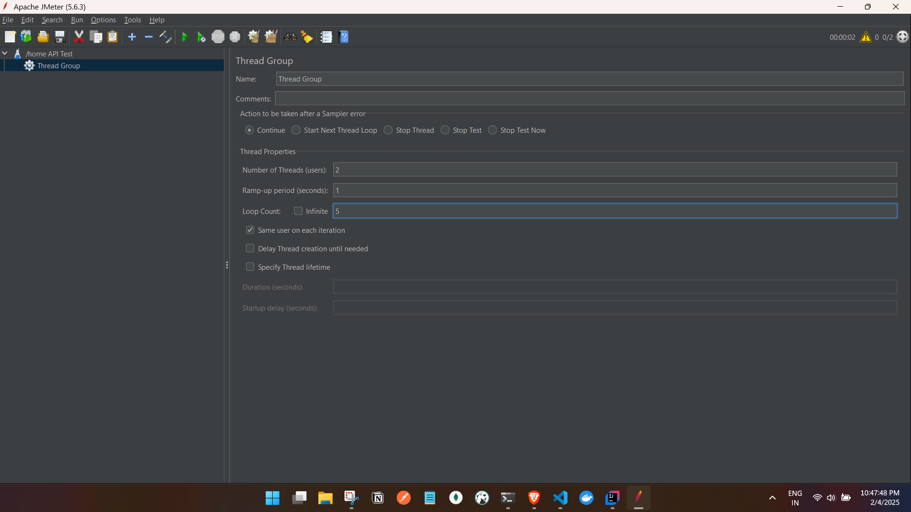
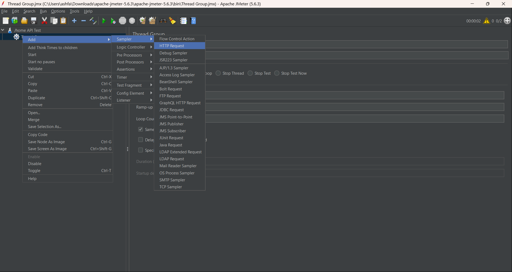
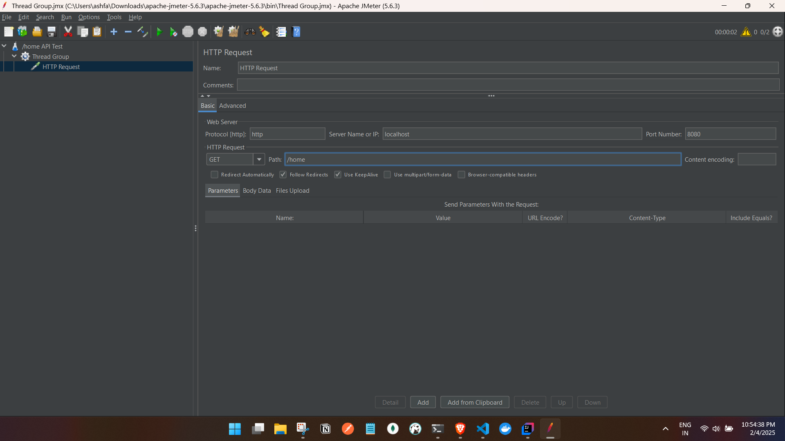
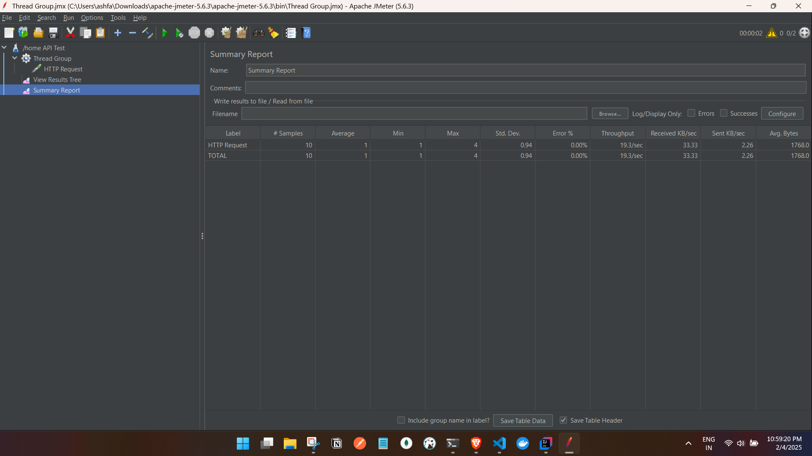

## Testing a Spring Boot API with JMeter Snippets:

- Save the plan


- create the Thread group


Ctrl + S to save it

- configure the API Call



- checking the result analysis

select both "View Results Tree" and "Summary Report"
save it and run it the green play button.


```
our sample api
@Controller
public class ContentController {

  static int counter =1;
  @GetMapping("/home")
  public String handleWelcome()


  {

    System.out.println( "Calling home " + counter);
    counter++;
    return "home";
  }
}

```

Result:



## Testing a Spring Boot API with JMeter

JMeter is an excellent tool for testing Spring Boot APIs, allowing you to perform performance and functional testing. Here's a comprehensive step-by-step guide to test your Spring Boot API:

### 1. Prepare JMeter Setup

**Install JMeter**
- Download Apache JMeter from the official website
- Ensure you have Java installed on your system
- Launch JMeter application

### 2. Create a Test Plan

**Configure Test Plan**
- Open JMeter
- Right-click on "Test Plan"
- Add a Thread Group (Threads (Users) Group)
- Set the number of threads (concurrent users)
- Configure ramp-up period and loop count[1][4]

### 3. Add HTTP Request Sampler

**Configure API Request**
- Right-click on Thread Group
- Select "Add" -> "Sampler" -> "HTTP Request"
- Enter your Spring Boot application details:
  - Server Name/IP: typically localhost
  - Port Number: your application's port (e.g., 8080)
  - HTTP Method: (GET/POST/PUT depending on your API)
  - Path: your specific API endpoint[3][4]

### 4. Add Request Body (For POST/PUT Requests)

**Prepare Request Payload**
- In the HTTP Request sampler
- Select "Body Data" option
- Enter your JSON payload matching your Spring Boot object structure
- Ensure the content matches your API's expected input format[5]

### 5. Add Listeners for Result Analysis

**Configure Result Tracking**
- Right-click on Thread Group
- Add "Listeners" like:
  - "View Results Tree"
  - "Summary Report"
  - These will help you analyze test results[4]

### 6. Add Response Assertions

**Validate API Response**
- Add Response Assertions to check:
  - HTTP Response Code (e.g., 200 for success)
  - Response content
  - This ensures your API responds correctly[3]

### 7. Run and Analyze Test

**Execute Performance Test**
- Save your test plan
- Click the "Run" button (green play icon)
- Analyze results in the configured listeners
- Check response times, error rates, and other metrics[4]

### Advanced Techniques

**Performance Testing Enhancements**
- Simulate different load conditions
- Adjust thread count and ramp-up period
- Use timers to introduce realistic user behavior
- Integrate with CI/CD pipeline for continuous testing[1]

### Key Considerations

**Best Practices**
- Start with small, focused tests
- Gradually increase complexity
- Monitor both functional correctness and performance
- Use realistic data and load scenarios

By following these steps, you can effectively test your Spring Boot API using JMeter, ensuring its performance, reliability, and functionality under various conditions.

Citations:
[1] https://www.codefro.com/2023/10/03/performance-testing-with-jmeter/
[2] https://www.simplilearn.com/tutorials/jmeter-tutorial/jmeter-load-testing
[3] https://blog.vsoftconsulting.com/blog/a-step-by-step-guide-to-test-rest-api-with-jmeter
[4] https://apidog.com/blog/jmeter-api-testing-tutorial/
[5] https://www.simplilearn.com/tutorials/jmeter-tutorial/jmeter-api-testing
[6] https://blog.octoperf.com/rest-api-testing-with-jmeter-step-by-step-guide/
[7] https://abstracta.us/blog/performance-testing/jmeter-api-testing/
[8] https://github.com/nikita9604/Performance-Testing-of-Spring-using-JMeter
[9] https://www.baeldung.com/jmeter
[10] https://stackoverflow.com/questions/69294949/testing-the-java-methods-through-the-jmeter
[11] https://www.youtube.com/watch?v=7RYrFUeJwvw
[12] https://www.youtube.com/watch?v=eqZORQpOuZA
[13] https://www.blazemeter.com/blog/rest-api-testing
[14] https://www.knowledgefactory.net/2020/12/Jmeter-Rest-API-load-testing-using-Apache-Jmeter.html
[15] https://github.com/tufangorel/spring-boot-maven-jmeter-performance-test
[16] https://www.youtube.com/watch?v=JHTOomFpnuo
[17] https://howtodoinjava.com/java/library/jmeter-beginners-tutorial/
[18] https://www.simplilearn.com/tutorials/jmeter-tutorial/jmeter-api-testing
[19] https://www.youtube.com/watch?v=8r5LYzUIepo
